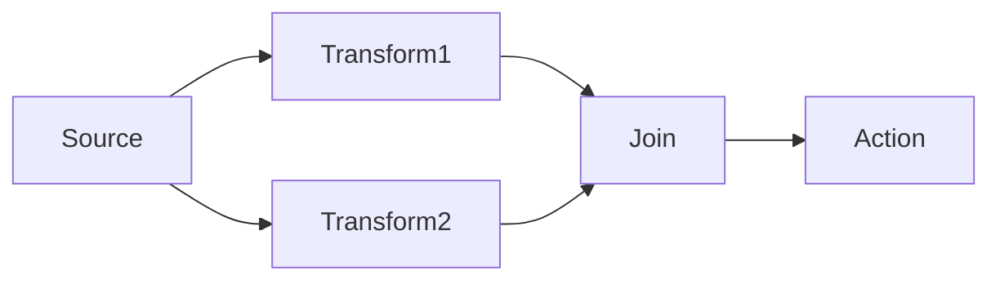
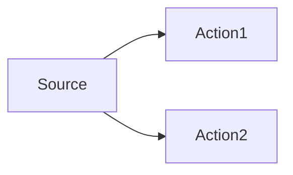
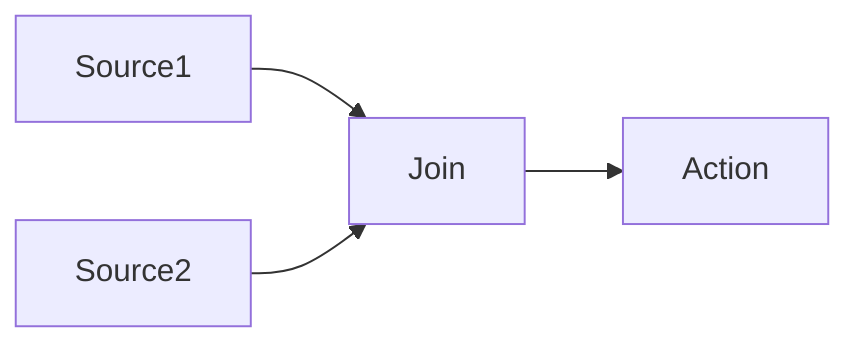
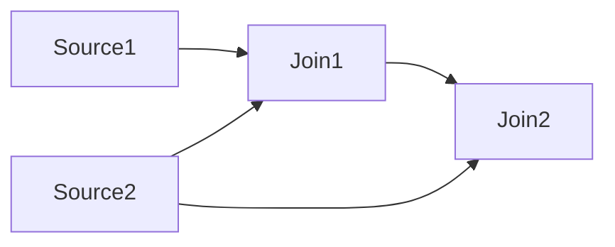

# Dataflow

## What is Dataflow?

Dataflow is a set of programming patterns and APIs for .NET that support [actor-based programming](https://en.wikipedia.org/wiki/Actor_model), where blocks are linked together and messages flow between them. This programming model supports robust concurrent computation, particularly for complex, stateful systems.

Dataflow blocks, which are akin to actors, are computational entities that operate on and produce messages that are exchanged with other blocks. Blocks may be stateful or stateless, but they always encapsulate their state such that modifying or querying that state occurs via messages. This encapsulation prevents common problems associated with concurrent processing, such as data races. Dataflow blocks, as units of computation, can be distributed across threads on the thread pool, making them scale well across hardware resources.

By linking blocks together, a _dataflow graph_ is created, with blocks as the graph's nodes, and messages passing along the graph's edges. Some blocks function as data sources, other as data receivers, and others still as both receivers and providers. Here's a simple example:


Here the _Source_ block produces data which is received by the _Transform_ block. That block performs some computation on its input before producing a new message for consumption by the the final _Action_ block.

In practice, Dataflow graphs are much larger and less linear, with forks and joins, such as:



Dataflow originates from the [Task Parallel Library](https://learn.microsoft.com/dotnet/standard/parallel-programming/dataflow-task-parallel-library) (TPL). CPS extends TPL's Dataflow in several ways, which we will see later ([Datflow in CPS](#dataflow-in-cps)).

Dataflow's strengths are its support for concurrent processing, it's scalability, and its fault tolerance. The weaknesses of Dataflow are it's complexity and the overhead of message passing and scheduling.

## Snapshots

The messages passed between blocks must be immutable _snapshots_ &mdash; .NET objects that cannot change over time.

The immutability of messages is an important property of a Dataflow graph, as it enables the computation of each node to occur without explicit synchronisation between nodes. A block that produces a snapshot does not know when (or even if) any downstream block will process it. If messages could change over time, there would exist a race condition between receiving blocks and mutating blocks, which would lead to unpredictable behaviour and difficult-to-diagnose bugs.

## Threading and asynchrony

Conceptually, messages sent between blocks are placed into queues. Computation performed by each block occurs on the .NET thread pool (by default) and multiple blocks may operate concurrently.

Message order is preserved however, in most cases. Consider:



If source produces messages `M1`, `M2` and `M3`, then both `Action1` and `Action2` will receive all three messages in their original order. However there's no synchronisation between `Action1` and `Action2`. One might complete all messages before the other, or vice versa, or they may be interleaved.

In general this is fine, however when we want to join these streams of messages over time, we need to be mindful of these race conditions. We handle that in CPS by assigning versions to messages, which we will talk about later.

The asynhronous nature of Dataflow also makes it possible to accidentally create deadlocks when blocks require shared resources like the UI thread, or shared synchronisation primitives. CPS offers techniques to prevent these kinds of problems, which we will talk about later.

## Types of Dataflow block

A Dataflow graph will be comprised of blocks of various types, each with its own purpose and behaviour.

> ℹ️ TPL's versions of Dataflow blocks have more features than CPS usually needs. We generally use CPS's "slim" versions of these blocks which come with fewer capabilities but demand fewer resources. We'll mention these briefly in each section below and in more detail later.

### Core interfaces

First let's see the core interfaces that define Dataflow blocks. The following types are all found in the `System.Threading.Tasks.Dataflow` namespace.

```c#
public interface IDataflowBlock
{
    Task Completion { get; }
    void Complete();
    void Fault(Exception exception);
}

public interface ISourceBlock<out TOutput> : IDataflowBlock
{
    IDisposable LinkTo(ITargetBlock<TOutput> target, DataflowLinkOptions linkOptions);
    // Three members omitted
}

public interface ITargetBlock<in TInput> : IDataflowBlock
{
    // One member omitted
}

public interface IPropagatorBlock<in TInput, out TOutput> : ITargetBlock<TInput>, ISourceBlock<TOutput>
{
    // No additional members beyond those inherited from ITargetBlock<TInput> and ISourceBlock<TOutput>
}
```

> ℹ️ For simplicity, a few internal-facing members of these interfaces have been omitted. They are only used when authoring your own block types, which is very rare, and are not necessary for this introduction.

All blocks implement `IDataflowBlock`, though usually indirectly through a more specific interface, which we will discuss shortly. This interface defines some lifetime management for the block. The `Completion` property exposes a `Task` that can be used to wait on the block's _completion_. Completion can be either successful (by a call to `Complete()`), or erroneous (by a call to `Fault(Exception)`). Either way, at that point the block has processed all data and will perform no further work.

`ISourceBlock<TOutput>` blocks are capable of producing messages of type `TOutput`. They inherit all the lifetime members of `IDataflowBlock`. Messages produced by this block can be routed to another block via the `LinkTo` method, which we will discuss later.

`ITargetBlock<TInput>` blocks can receive messages of type `TOutput`. They inherit all the lifetime members of `IDataflowBlock`. It's down to the implementation to decide what to do with the received message.

`IPropagatorBlock<TInput, TOutput>` blocks are both `ISourceBlock<TInput>` and `ITargetBlock<TOutput>`. They inherit all the lifetime members of `IDataflowBlock` and may both receive and produce messages of potentially different types.

### Action blocks

Perhaps the simplest block to reason about is the `ActionBlock<TInput>`. It is an `ITargetBlock<TInput>` that receives messages and invokes a callback action for each.

> ⚠️ In CPS we use "slim" action blocks via the `DataflowBlockSlim.CreateActionBlock<TInput>` methods.

The callback may be either a `System.Action<TInput>` for synchronous processing, or a `System.Func<TInput, Task>` for asynchronous processing.

The block ensures that processing for each message is completed (sync or async) before invoking the next callback. Any pending messages are queued.

### Transform blocks

A `TransformBlock<TInput, TOutput>` is an `IPropagatorBlock<TInput, TOutput>` that receives a message, performs some computation with it, and produces an output.

> ⚠️ In CPS we use "slim" action blocks via the `DataflowBlockSlim.CreateTransformBlock<TInput, TOutput>` methods.

The transform function may be synchronous via `System.Func<TInput, TOutput>` or asynchronous via `System.Func<TInput, Task<TOutput>>`. 

The input and output messages may have different types, and commonly do.

Every input to the block produces one output.

### TransformMany blocks

A `TransformManyBlock<TInput, TOutput>` is an `IPropagatorBlock<TInput, TOutput>` that receives a message, performs some computation with it, and produces an zero or more outputs.

> ⚠️ In CPS we use "slim" action blocks via the `DataflowBlockSlim.CreateTransformManyBlock<TInput, TOutput>` methods.

The transform function may be synchronous via `System.Func<TInput, IEnumerable<TOutput>>` or asynchronous via `System.Func<TInput, Task<IEnumerable<TOutput>>>`. 

The input and output messages may have different types, and commonly do.

Unlike `TransformBlock<TInput, TOutput>`, where every input to the block produces one output, the `TransformManyBlock<TInput, TOutput>` allows any number of outputs for a given input. This turns out to be useful in several ways:

- It supports filtering of messages, where a given input may or may not be forwarded.
- It can split a composite input up into a series of separate messages to be processed separately (similar to Linq's `SelectMany`).

### Broadcast blocks

A `BroadcastBlock<T>` is an `IPropagatorBlock<T, T>` that stores the most recent value. Blocks that link to a `BroadcastBlock<T>` will receive that stored value immediately, rather than having to wait for the next value to be published.

> ⚠️ In CPS we use "slim" action blocks via the `DataflowBlockSlim.CreateBroadcastBlock<T>` methods.

Broadcast blocks do not provide a callback for user code to run during their processing. They are fully self-contained.

### Buffer blocks

`BufferBlock<T>` is an `IPropagatorBlock<T, T>` that maintains a queue (buffer) of values. If more messages are received than have been consumed, the pending messages are held. The queue length can be specified via `DataflowBlockOptions.BoundedCapacity`.

> ⚠️ In CPS we use "slim" action blocks via the `DataflowBlockSlim.CreateSimpleBufferBlock<T>` methods.

Buffer blocks do not provide a callback for user code to run during their processing. They are fully self-contained.

In the case that a buffer block has multiple linked downstream blocks, each incoming message is sent to only one downstream block. By contrast, a `Broadcast<T>` block sends each message to every linked block.

### Other blocks

TPL Dataflow defines a few other block types, such as `BatchBlock<T>`, `JoinBlock<T>` and `WriteOnceBlock<T>`, though we don't generally use them with CPS.

CPS defines quite a few specific kinds of block too, as well as some additional concepts built on top of TPL Dataflow, which we will discuss later.

It's possible to author your own blocks for special scenarios, though this is usually not necessary and can be tricky to get right. Combining existing block types is very flexible and can achieve almost everything you would want to do with Dataflow.

## Stateful blocks

Blocks that invoke callbacks when processing messages (like `TransformBlock`, `TransformManyBlock` and `ActionBlock`) can maintain and utilise state that exists outside the messages themselves. For example, if a block receives a series of deltas over time, the block could integrate them in a snapshot such that a full snapshot state is published for each incoming delta.

Here's an example where a transform block adds input numbers over time and publishes that sum.

```c#
ISourceBlock<int> source = ...;
int sum = 0;
ITransformBlock<int, int> transform = DataflowBlockSlim.CreateTransformBlock<int, int>(i => { sum += i, return sum; });
source.LinkTo(transform, ...);
```

## Completing and faulting blocks

As we saw earlier, all blocks implement `IDataflowBlock`, which has the following members:

```c#
public interface IDataflowBlock
{
    Task Completion { get; }
    void Complete();
    void Fault(Exception exception);
}
```

This interface defines some lifetime management for the block. The `Completion` property exposes a `Task` that can be used to wait on the block's _completion_. Completion can be either successful (by a call to `Complete()`), or erroneous (by a call to `Fault(Exception)`). Either way, at that point the block has processed all data and will perform no further work.

A common way for a block to complete in a faulted state is for an unhandled exception to occur when the block calls back into user code, such as an `ActionBlock`'s `Action`, or a `TransformBlock`'s `Func`. Once a block has faulted, it will not recover. Any component that depends upon that data stream will no longer receive updates or commands. It's important that we think about fault handling in our Dataflow graphs, and ensure that faults are surfaced to the user rather than happening silently, where only the symptom of the fault is noticed some time later.

Completion (both graceful and erroneous) can propagate from one block to another. This tends to be desirable, as once upstream blocks have completed, downstream blocks will no longer receive updates. Without propagating compltion, it's easy to end up with deadlocks where components are waiting for updates that will never arrive.

Later we'll see how CPS helps with fault handling.

## Linking blocks

We've talked a lot about different kinds of blocks, but they're not much use unless we actually link them together.

Generally this is quite straightforward. Once we have two blocks to link, we call `LinkTo` on the source, and pass the target as an argument:

```c#
ISourceBlock<MyMessage> source = ...;
ITargetBlock<MyMessage> target = ...;

IDisposable subscription = source.LinkTo(target, ...);
```

With this code, when `source` produces a message, it will be sent to `target`.

The return value of `LinkTo` is an `IDisposable` that, when disposed, unlinks the blocks. Note that unlinking is distinct from block completion, although when two blocks are unlinked, completion can no longer propage from the source to the target.

In the above example we glossed over the second argument to `LinkTo`, which is a `DataflowLinkOptions` object. This object provides information about the behaviour of the link. One of the most important options here controls completion propagation. We almost always want to set this to `true`.

```c#
IDisposable subscription = source.LinkTo(target, new DataflowLinkOptions() { PropagateCompletion = true });
```

CPS has a few subclasses of `DataflowLinkOptions` that you can use in certain circumstances to further customise links in some CPS patterns, which we'll see later.

---

# Dataflow in CPS

## Slim blocks

TPL's Dataflow blocks are general purpose and have feautres that aren't used in CPS. Those unused features come with a performance/memory cost. To improve the scalability of CPS in large solutions, we have a replacement set of "slim" blocks that provide the required behaviours of TPL's blocks, but without the overhead associated with the unused features.

| TPL Block                                 | CPS Slim Block                                                |
|-------------------------------------------|---------------------------------------------------------------|
| `new ActionBlock<T>`                      | `DataflowBlockSlim.CreateActionBlock<T>`                      |
| `new BufferBlock<T>`                      | `DataflowBlockSlim.CreateSimpleBufferBlock<T>`                |
| `new BroadcastBlock<T>`                   | `DataflowBlockSlim.CreateBroadcastBlock<T>`                   |
| `new TransformBlock<TInput, TOutput>`     | `DataflowBlockSlim.CreateTransformBlock<TInput, TOutput>`     |
| `new TransformManyBlock<TInput, TOutput>` | `DataflowBlockSlim.CreateTransformManyBlock<TInput, TOutput>` |

## Versions and versioned values

Dataflow graphs publish immutable snapshots of data between blocks, where updates are pushed through the graph in an asynchronous fashion. This gives the framework a lot of flexibility to schedule the work, but can make it difficult to know when a given input has made its way through the graph to the outputs.

Another challenge with Dataflow graphs is joining data. Consider the following graph:


The `Join` block receives `Source` data via two paths. Those paths may take different durations, leading the `Join` block to receive different versions of the `Source` data at the same time. Such inconsistency can lead to problems that wouldn't exist if `Join` always saw a consistent view of the world from a given point in time.

To address these issues, nearly all Dataflow messages in CPS have an associated version. These versions allow synchronising across portions of the graph, addressing the above problems.

Versioned values are represented as `IProjectVersionedValue<T>`, and most Dataflow blocks in CPS pass instances of this interface around, with different types for `T`. You can think of this interface as wrapping a message and attaching the version to it.

```c#
public interface IProjectVersionedValue<out T> : IProjectValueVersions
{
    T Value { get; }
}

public interface IProjectValueVersions
{
    IImmutableDictionary<NamedIdentity, IComparable> DataSourceVersions { get; }
}
```

And in fact, a versioned value can have _more than one version!_ This makes sense when you consider that a given node in the graph can have more than one source block feeding in to it. Each of those source blocks provides its own versioned value, and as messages are joined, the sets of versions are merged.



In this example, `Action` would receive versions for both `Source1` and `Source2` in the `DataSourceVersions` property above.

The `NamedIdentity` type is a unique key for a source's version. The `IComparable` value can be anything in theory, but is usually an `int` in practice.

### Transforming versioned values

When a `TransformBlock<IProjectVersionedValue<TInput>, IProjectVersionedValue<TOutput>>` is transforming its versioned values, it (generally) assigns the versions of its input to its output. A convenient way to achieve this is via the `Derive` extension method:

```c#
var transform = DataflowBlockSlim.CreateTransformBlock<IProjectVersionedValue<int>, IProjectVersionedValue<string>>
	(input => input.Derive(num => num.ToString()));
```

### SyncLink

Dataflow graphs in CPS can become large and complex. Even if the number of blocks used within a component is small, it's likely that those blocks are producing data that is derived from upstream blocks. Similarly a component's outputs may feed into other Dataflow blocks.

Each source block in the graph produces increasing versions of its data, and those versions flow through the system with the value, and with values derived from it.

Consider the following graph, where data from two source blocks is combined in multiple paths:



Notice how `Join2` receives data from `Source2` via two paths, both directly and via `Join1`. Remember that Dataflow processing is asynchronous. Updates may flow through the graph with different timings on different runs. Without any synchronization, `Join2` may receive data from `Join1` containing v1 from `Source2`, and data from `Source2` containing v2 from that source. This is a data race. It's most likely that `Join2` will produce invalid data when merging data from two different versions of project data.

To address this problem in a clean way, we use `SyncLink`. This block observes the versions at its inputs, and only produces outputs when version numbers align.

Here's a table showing a `SyncLink` block with two inputs and an output, with time running left-to-right and the versions of each input/output given. Notice that only when both input versions align is an output produced. Notice too that version 2 is never produced, as input 1 receives version 3 before input 2 receives version 2.

```
Input 1 |  1     2  3
Input 2 |     1       2   3
Output  |     1           3
```

> ⚠️ A `SyncLink` block that never sees synchronized input versions will never produce an output!

> ⚠️ Upstream blocks that suppress version-only updates may cause downstream `SyncLink` blocks to drop messages.

Recall that `IProjectVersionedValue<T>` may hold multiple versions, keyed by `NamedIdentity`. In our example above:

- `Source1` produces values with a single `Source1` version
- `Source2` produces values with a single `Source2` version
- `Join1` produces values with both `Source1` and `Source2` versions
- `Join2` produces values with both `Source1` and `Source2` versions

In our example, `Join1` does not need to be a `SyncLink` as none of its inputs have versions in common, so there is nothing to join on. `SyncLink` will only join on the intersection of versions between its inputs. It makes sense for `Join2` to be a `SyncLink` as the `Source2` version is present at both of its inputs.

You could construct the `SyncLink` for `Join2` as follows:

```c#
IDisposable link = ProjectDataSources.SyncLinkTo(
    join1.SourceBlock.SyncLinkOptions(),
    source2.SourceBlock.SyncLinkOptions(),
    target: join2,
    linkOptions: new DataflowLinkOptions { PropagateCompletion = true },
    cancellationToken: cancellationToken),
```

The `SyncLinkOptions` extension method allows the data source to be configured. If the source contains rule-based data (discussed [below](#rule-sources)) 

## Subscribing to project data

One of the main use cases for Dataflow in CPS is the processing of project data. Unlike the legacy CSPROJ project system where updates were generally applied on a single thread (the main thread), CPS uses Dataflow to schedule updates asyncrhonously on the thread pool.

The `IProjectSubscriptionService` interface provides data sources for the most commonly used kinds of project data. It's exported as a MEF component in `ConfiguredProject` scope. Every property on that interface is an `IProjectValueDataSource<T>` of a specific data type, where that data is an immutable snapshot of some state. The following table outlines the available sources:

| Property                    | Data Type                    | Description |
|-----------------------------|------------------------------|-------------|
| `ProjectSource`             | `IProjectSnapshot`           | MSBuild `ProjectInstance` snapshot. |
| `ProjectRuleSource`         | `IProjectSubscriptionUpdate` | Project evaluation data as both a snapshot and delta, according to rule schema. |
| `ProjectBuildRuleSource`    | `IProjectSubscriptionUpdate` | Project (design-time) build data as both a snapshot and delta, according to rule schema. |
| `JointRuleSource`           | `IProjectSubscriptionUpdate` | Synchronized project data from evaluation and build, both a snapshot and delta, according to rule schema. |
| `SourceItemsRuleSource`     | `IProjectSubscriptionUpdate` | Project source item snapshot. |
| `SourceItemRuleNamesSource` | `IImmutableSet<string>`      | The set of rule names that define project source items. |
| `ImportTreeSource`          | `IProjectImportTreeSnapshot` | Tree of MSBuild files (e.g. props/targets) imported by the project. |
| `SharedFolderSource`        | `IProjectSharedFoldersSnapshot` | Collection of shared folders imported by the project. |
| `OutputGroupsSource`        | `IImmutableDictionary<string, IOutputGroup>` | Sets of project outputs keyed by category. |
| `ProjectCatalogSource`      | `IProjectCatalogSnapshot`    | Project snapshot bundled with rules that interpret the data. |

As with all Dataflow in CPS, the data produced by these sources are immutable snapshots of their respective data.

All these sources are `IProjectValueDataSource<T>` and so the values produced have associated versions, as described [earlier](#versions-and-versioned-values).

### Rule sources

CPS uses rules to (among other things) specify the schema of MSBuild items and properties to be extracted from the project via Dataflow. The structure of the rule (the properties it defines and their data sources) control the shape of the snapshots produced by certain data sources in CPS, as we will see.

Of the sources provided by `IProjectSubscriptionService`, the sources `ProjectRuleSource`, `ProjectBuildRuleSource` and `JointRuleSource` are treated specially. When subscribing to one of these sources, you must specify the set of rule names for the data in question. 

> ℹ️ℹ️ Note that `IProjectSubscriptionService.SourceItemsRuleSource` does not require you to specify rule names, as those are defined elsewhere (and made available via `SourceItemRuleNamesSource`).

For example, to subscribe to the set of `Compile` and `None` items in the project, you would pass the `SchemaName` of the rules that define these items when subscribing to the `ProjectRuleSource`:

```c#
IProjectSubscriptionService projectSubscriptionService = ...;

IDisposable link = projectSubscriptionService.ProjectRuleSource.LinkTo(
    target: targetBlock,
    linkOptions: new DataflowLinkOptions { PropagateCompletion = true },
    ruleNames: new[] { Compile.SchemaName, None.SchemaName });
```

That `LinkTo` method is an extension method provided by the `Microsoft.VisualStudio.ProjectSystem.DataflowExtensions` class, of which there are a few overloads. There are also some optional parameters such as `initialDataAsNew` and `suppressVersionOnlyUpdates`.

When using a rule-based source in a `SyncLink` operation, you can declare the rule names by passing an instance of `StandardRuleDataflowLinkOptions` (a subclass of `DataflowLinkOptions`) on the given input's `SyncLinkOptions`:

```c#
IDisposable link = ProjectDataSources.SyncLinkTo(
    projectSubscriptionService.ProjectRuleSource.SourceBlock.SyncLinkOptions(),
    otherSource.SyncLinkOptions(
        new StandardRuleDataflowLinkOptions
        {
            RuleNames = ImmutableHashSet.Create(Compile.SchemaName, None.SchemaName)
        }),
    target: targetBlock,
    linkOptions: new DataflowLinkOptions { PropagateCompletion = true },
    cancellationToken: cancellationToken),
```

When using `JointRuleSource`, you may use `JointRuleDataflowLinkOptions` rather than `StandardRuleDataflowLinkOptions`, which allows specifying the rules for evaluation/build separately. This avoids CPS having to determine these categorisations itself, which can save some time.

### Project subscription updates

Several project data sources produce data snapshots as instances of `IProjectSubscriptionUpdate`. These snapshots contain:

1. The new state, for each included rule.
1. The prior state, for each included rule.
1. A delta between these two states.
1. The project configuration the data applies to.

The delta makes it easy to see what changed in the update (if anything), and to apply just the delta to your own state as required.

Rather than explain `IProjectSubscriptionUpdate` in words, it's probably cleare to just look at the API:

```c#
public interface IProjectSubscriptionUpdate
{
    // Keyed by rule name
    IImmutableDictionary<string, IProjectRuleSnapshot> CurrentState { get; }
    
    // Keyed by rule name
    IImmutableDictionary<string, IProjectChangeDescription> ProjectChanges { get; }

    ProjectConfiguration ProjectConfiguration { get; }
}

public interface IProjectChangeDescription
{
    IProjectRuleSnapshot Before { get; }
    IProjectRuleSnapshot After { get; }
    IProjectChangeDiff Difference { get; }
}

public interface IProjectRuleSnapshot
{
    string RuleName { get; }

    // Key is item name, value is a dictionary of item metadata
    IImmutableDictionary<string, IImmutableDictionary<string, string>> Items { get; }

    // Key is property name, value is property value
    IImmutableDictionary<string, string> Properties { get; }
}

public interface IProjectChangeDiff
{
    bool AnyChanges { get; }
    IImmutableSet<string> AddedItems { get; }
    IImmutableSet<string> RemovedItems { get; }
    IImmutableSet<string> ChangedItems { get; }
    IImmutableDictionary<string, string> RenamedItems { get; }
    IImmutableSet<string> ChangedProperties { get; }
}
```

## Creating `IProjectValueDataSource<T>` blocks

CPS's `IProjectValueDataSource<T>` blocks extend Dataflow's regular source blocks to both:

1. Ensure values are versioned and any version identity created by the block is knowable.
1. Coordinates shared access to the UI thread to prevent deadlocks.

See [Versions and versioned values](#versions-and-versioned-values) for more background on versions and identities.

CPS provides access to several such `IProjectValueDataSource<T>` instances via `IProjectSubscriptionService` (as described in [Subscribing to project data](#subscribing-to-project-data)). In some cases you may need to create your own instances of this type, which we will discuss next.

### Chained (derived) data sources

Most `IProjectValueDataSource<T>` instances will produce data that was derived from other project value data sources. CPS provides the abstract base class `ChainedProjectValueDataSourceBase<T>`, which makes creating such a derived (chained) source easy.

Let's look at an example of overriding this class to create a new data source that derives its data from one other source:

```c#
internal class MyChainedProjectDataSource : ChainedProjectValueDataSourceBase<MyData>
{
    private readonly IProjectSubscriptionService _subscriptionService;

    public MyChainedProjectDataSource(
        ConfiguredProject project,
        IProjectSubscriptionService subscriptionService)
        : base(project)
    {
        _subscriptionService = subscriptionService;
    }

    protected override IDisposable? LinkExternalInput(ITargetBlock<MyData> targetBlock)
    {
        IProjectValueDataSource<IProjectSubscriptionUpdate> source = _subscriptionService.ProjectRuleSource;

        // ⚠️ You must join all upstream IProjectValueDataSource's to prevent deadlocks
        JoinUpstreamDataSources(source);

        var transformBlock = DataflowBlockSlim.CreateTransformBlock<
            IProjectVersionedValue<IProjectSubscriptionUpdate>,
            IProjectVersionedValue<MyData>>(
                update => update.Derive(Transform));

        transformBlock.LinkTo(targetBlock, DataflowOption.PropagateCompletion);

        // Finally, create the first link and return it
        return source.LinkTo(
            transformBlock,
            new DataflowLinkOptions { PropagateCompletion = true },
            initialDataAsNew: true,
            suppressVersionOnlyUpdates: false,
            ruleNames: new[] { MyRule.SchemaName });

        MyData Transform(IProjectSubscriptionUpdate update)
        {
            // TODO produce output based on received update
        }
    }
}
```

The base class requires the project be passed to its constructor, and that the `LinkExternalInput` method be overriden. It will call that method when required, in order to set up the Dataflow chain. The method returns an `IDisposable` that, when disposed, must tear down the subscription. The base class handles all lifetime management.

Within `LinkExternalInput` we must take care to join (in the JTF sense) all upstream project value data sources. This allows JTF to correctly track related work when scheduling work to the main thread, which can avoid deadlocks.

`LinkExternalInput` accepts an `ITargetBlock<T>` to which we must publish our data source's output. Our inputs are typically accessed via the constructor, typically using a MEF `[ImportingConstructor]` when the class itself is exported for import elsewhere. The example above has omitted MEF concerns for simplicity.

In this sample we create a slim transform block that produces the derived data. We use the `Derive` extension method to create a new data object having the same versions as the source. The block in the above example will always produce the same versions at its outputs as received on its input. This is generally what's needed when chaining blocks together, as no new data has been injected.

### Original data sources

When data originates from a location other than existing `ProjectValueDataSource`s, it is an _original_ data source. In most cases, data sources are [chained (derived) from other data sources](#chained-derived-data-sources). However sometimes you really do have an original source.

Original sources produce `IProjectVersionedValue<T>` values that include a version unique to that source. Each must define their own `NamedIdentity` and track their own `IComparable` version. Typically the version is just an `int`.`

Here's an example of such an original data source. Code that obtains and produces the data is omitted. That code would call the `PublishSnapshot` helper method when it has new data to produce.

```c#
internal sealed class MyOriginalProjectDataSource : ProjectValueDataSourceBase<MyData>
{
    private readonly DisposableBag _disposables = new();
    private readonly UnconfiguredProject _project;

    private IBroadcastBlock<IProjectVersionedValue<MyData>>? _broadcastBlock;
    private IReceivableSourceBlock<IProjectVersionedValue<MyData>>? _publicBlock;

    private MyData? _currentState;
    private int _version;

    [ImportingConstructor]
    public MyOriginalProjectDataSource(
        UnconfiguredProject project,
        IUnconfiguredProjectServices unconfiguredProjectServices,
        IProjectThreadingService threadingService)
        : base(unconfiguredProjectServices)
    {
        _project = project;
    }

    public override NamedIdentity DataSourceKey { get; } = new NamedIdentity(nameof(MyOriginalProjectDataSource));

    public override IComparable DataSourceVersion => _version;

    public override IReceivableSourceBlock<IProjectVersionedValue<MyData>> SourceBlock
    {
        get
        {
            EnsureInitialized();
            return _publicBlock!;
        }
    }

    protected override void Initialize()
    {
        base.Initialize();

        _broadcastBlock = DataflowBlockSlim.CreateBroadcastBlock<IProjectVersionedValue<MyData>>(nameFormat: nameof(MyOriginalProjectDataSource) + " Broadcast: {1}");
        _publicBlock = _broadcastBlock.SafePublicize();

        // TODO Any other configuration for this block, including establishing other dataflows
        //      and joining upstream data sources. When data is available, it should either flow
        //      to _broadcastBlock via a Dataflow link, or via Post as shown in PublishSnapshot below.
        //      Add any disposable items to _disposables to be cleaned up along with the data source.
    }

    protected override void Dispose(bool disposing)
    {
        _disposables.Dispose();
        base.Dispose(disposing);
    }

    private void PublishSnapshot(MyData snapshot)
    {
        _version++;
        _broadcastBlock!.Post(new ProjectVersionedValue<MyData>(
            snapshot,
            Empty.ProjectValueVersions.Add(DataSourceKey, _version)));
    }
}
```

Notice that we store fields for two blocks. the `_broadcastBlock` is the block that we use to publish data. while we could expose this object via the `SourceBlock` property, that would allow external code to [complete or fault](#completing-and-faulting-blocks) the data source, stopping it working for all consumers. To prevent this, we use the `SafePublicize()` method to create a thin wrapper around `_broadcastBlock` that prevents external requests for completion or faults, and store the wrapper in `_publicBlock` to be handed out via the `SourceBlock` property.

## Exporting and composing data sources via MEF

The composability of Dataflow blocks makes them very flexible and reusable. However, in order to compose blocks, you must first find them. Like most service discovery in CPS project systems, we use MEF.

CPS exposes [project data sources](#subscribing-to-project-data) via `IProjectSubscriptionService`, which can be imported via MEF in `ConfiguredProject` scope. Project data (evaluation and build) generally comes from a configured project.

There's nothing special to these kinds of imports and exports, and they follow general MEF conventions for CPS. You may, for example, define your own interface `IMyDataSource` and implement it with your `ProjectValueDataSourceBase<T>`/`ChainedProjectValueDataSourceBase<T>` implementation (as discussed above), with something like:

```c#
[ProjectSystemContract(/* specify scope, etc */)]
interface IMyDataSource : IProjectValueDataSource<MyData>
{}

[Export(typeof(IMyDataSource))]
internal sealed class MyDataSource : ChainedProjectValueDataSource<MyData>
{
    // [ImportingConstructor], LinkExternalInput, etc
}
```

Then elsewhere you can import `IMyDataSource` and use its `SourceBlock` property. As with all MEF components, you need to be mindful of scopes.

## Combining a dynamic number of data sources

Sometimes you want to join data across a set sources that is only known at runtime. For example, there might be a dynamic number of user-created objects in the project (such as debug launch profiles), each exposed as its own data source. In such a case, the set of data sources is not known at compile time. What's more, the set of data sources can change during the lifetime of a project in response to the user's changes. If you want to combine data across all configurations into a single snapshot, managing all those components by hand would be verbose and difficult to get right.

The `UnwrapCollectionChainedProjectValueDataSource<TInput, TOutput>` block has been designed with this scenario in mind, and takes care of the tricky bookkeeping for you.

- It is both an `ITargetBlock<TInput>` and a `ISourceBlock<IReadOnlyCollection<TOutput>>`
- It's input `TInput` is a data type via which you can obtain the data sources you want to combine.
- The block's constuctor accepts a delegate of type `Func<TInput, IEnumerable<IProjectValueDataSource<TOutput>>>`, and invokes this callback for each `TInput` to obtain the set of data sources to be combined.
- Finally, the block outputs `SyncLink`'d values, one per input, in the output `IReadOnlyCollection<TOutput>`.

## ConfiguredProjectDataSourceJoinBlock

In the previous section we discussed combining data from a dynamic number of data sources. One of the most common cases for this is the combining of data across the project's various configurations. This is so common in fact that CPS provides a dedicated class to help with this: `ConfiguredProjectDataSourceJoinBlock`.

Here's an example that takes the `IMyConfiguredDataSource` (which is an `IProjectValueDataSource<MyConfiguredDataSnapshot>`) from each `ConfiguredProject` MEF scope and aggregates them:

```c#
var disposableBag = new DisposableBag();

// Find the IMyConfiguredDataSource in each ConfiguredProject scope and produce a collection containing
// the most recent value from each. The number of returned items reflects the number of configurations
// and may change over time as configurations are added.
ConfiguredProjectDataSourceJoinBlock<MyConfiguredDataSnapshot> configuredProjectJoinBlock = new(
    configuredProject => configuredProject.Services.ExportProvider.GetExportedValue<IMyConfiguredDataSource>(),
    joinableTaskFactory,
    unconfiguredProject);

disposableBag.AddDisposable(configuredProjectJoinBlock);

// Takes the collection of values from each configuration's data source, and combines them into a
// single snapshot.
var mergeBlock = DataflowBlockSlim.CreateTransformBlock<IProjectVersionedValue<IReadOnlyCollection<MyConfiguredDataSnapshot>>, IProjectVersionedValue<MyMergedDataSnapshot>>(
    messages => messages.Derive(MergeData),
    nameFormat: "Merge configured data snapshots {1}",
    skipIntermediateInputData: true); // skip data when we fall behind (might not be safe for your scenario!)

mergeBlock.LinkTo(targetBlock, new DataflowLinkOptions() { PropagateCompletion = true });

configuredProjectJoinBlock.LinkTo(mergeBlock, new DataflowLinkOptions() { PropagateCompletion = true });

// Link a data source of active ConfiguredProjects into the join block.
disposableBag.AddDisposable(
    activeConfigurationGroupService.ActiveConfiguredProjectGroupSource.SourceBlock.LinkTo(
        configuredProjectJoinBlock,
        new DataflowLinkOptions() { PropagateCompletion = true }));

// We must always join upstream data sources.
disposableBag.AddDisposable(
    JoinUpstreamDataSources(activeConfigurationGroupService.ActiveConfiguredProjectGroupSource));
```

## Consuming project data from the active configuration

Consider a project with a single platform (`AnyCPU`) and single target framework (it doesn't matter which). The matrix of possible project configurations might resemble:

Configuration | Platform
--------------|---------
Debug         | AnyCPU
Release       | AnyCPU

Visual Studio allows the user to select the current active configuration. For example, you can switch between _Debug_ and _Release_ via a drop down list in the standard tool bar. In our example, only one of those two configurations would be active at a given time.

`IProjectSubscriptionService` (discussed above) provides a convenient way to access project data within a specific configuration. Unsubscribing and resubscribing every time the active configuration changes requires a moderate amount of tricky code that would be prone to errors and hangs. Thankfully it's possible to import `IActiveConfiguredProjectSubscriptionService` from the `UnconfiguredProject` scope, the implementation of which performs that work for you. That interface itself derives from `IProjectSubscriptionService`. Subscribing to data sources on that import will always produce data from the active configuration. When the user changes the active configuration, any delta in the data between configurations is published via the same dataflow, allowing the consumer to be unaware of the specific configuration involved.

The downside is that this approach does not handle multi-targeting projects. When a project specifies multiple target frameworks, only one can be considered as active. The others are _implicitly_ active, but their data is not available via `IActiveConfiguredProjectSubscriptionService`. If you require data from all target frameworks, read the next section on _slices_.

## Consuming project data from all implicitly active configurations (via slices)

The concept of _slices_, and the APIs that support them, simplify the implementation of components that consume data from all _implicitly active configurations_ (generally, all target frameworks) of the _active_ project configuration.

To understand this in more detail, let's first discuss some concepts around project configurations.


## Avoiding hangs (JoinUpstreamDataSources)

## Dataflow source registries

## GetLatestVersionAsync / GetSpecificVersionAsync

## Mixing dataflow and live project data

## Registering blocks for fault handling

## Skipping intermediate input/output data

## Operation progress and Dataflow

## Diagnosing issues / `!dumpdf` / nameFormat

## Other data via Dataflow

- Capabilities
