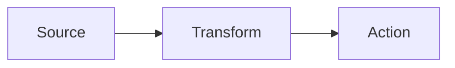
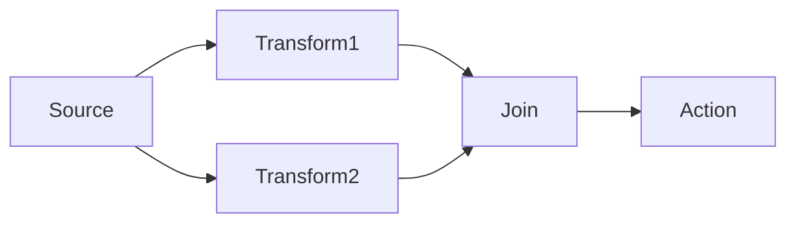
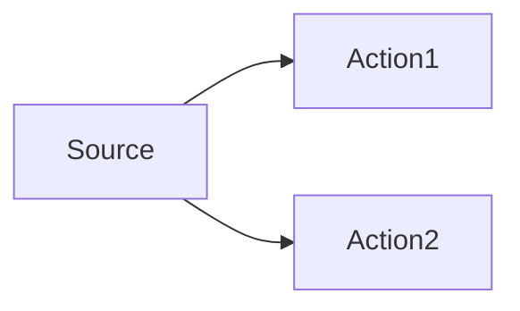
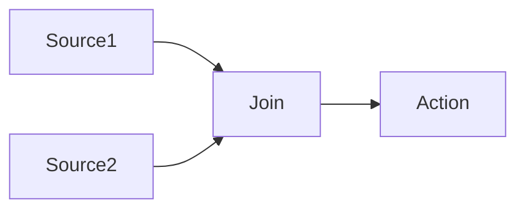

# Dataflow

## What is Dataflow?

Dataflow is a set of programming patterns and APIs for .NET that support [actor-based programming](https://en.wikipedia.org/wiki/Actor_model), where blocks are linked together and messages flow between them. This programming model supports robust concurrent computation.

By linking nodes together, a _dataflow graph_ is created. Some nodes function as data sources, other as data receivers, and others still as both receivers and providers. Here's a simple example:



Here the _Source_ block produces data which is received by the _Transform_ block. That block performs some computation on its input before producing a new message for consumption by the the final _Action_ block.

In practice, Dataflow graphs are much larger and less linear, with forks and joins, such as:



Dataflow originates from the [Task Parallel Library](https://learn.microsoft.com/dotnet/standard/parallel-programming/dataflow-task-parallel-library) (TPL). CPS extends TPL's Dataflow in several ways, which we will see later.

## Snapshots

The messages passed between blocks must be immutable _snapshots_ &mdash; .NET objects that cannot change over time.

The immutability of messages is an important property of a Dataflow graph, as it enables the computation of each node to occur without explicit synchronisation between nodes. A block that produces a snapshot does not know when (or even if) any downstream block will process it. If messages could change over time, there would exist a race condition between receiving blocks and mutating blocks, which would lead to unpredictable behaviour and difficult-to-diagnose bugs.

## Threading and asynchrony

Conceptually, messages sent between blocks are placed into queues. Computation performed by each block occurs on the .NET thread pool (by default) and multiple blocks may operate concurrently.

Message order is preserved however, in most cases. Consider:



If source produces messages `M1`, `M2` and `M3`, then both `Action1` and `Action2` will receive all three messages in their original order. However there's no synchronisation between `Action1` and `Action2`. One might complete all messages before the other, or vice versa, or they may be interleaved.

In general this is fine, however when we want to join these streams of messages over time, we need to be mindful of these race conditions. We handle that in CPS by assigning versions to messages, which we will talk about later.

The asynhronous nature of Dataflow also makes it possible to accidentally create deadlocks when blocks require shared resources like the UI thread, or shared synchronisation primitives. CPS offers techniques to prevent these kinds of problems, which we will talk about later.

## Types of Dataflow block

A Dataflow graph will be comprised of blocks of various types, each with its own purpose and behaviour.

> ℹ️ TPL's versions of Dataflow blocks have more features than CPS usually needs. We generally use CPS's "slim" versions of these blocks which come with fewer capabilities but demand fewer resources. We'll mention these briefly in each section below and in more detail later.

### Core interfaces

First let's see the core interfaces that define Dataflow blocks. The following types are all found in the `System.Threading.Tasks.Dataflow` namespace.

```c#
public interface IDataflowBlock
{
    Task Completion { get; }
    void Complete();
    void Fault(Exception exception);
}

public interface ISourceBlock<out TOutput> : IDataflowBlock
{
    IDisposable LinkTo(ITargetBlock<TOutput> target, DataflowLinkOptions linkOptions);
    // Three members omitted
}

public interface ITargetBlock<in TInput> : IDataflowBlock
{
    // One member omitted
}

public interface IPropagatorBlock<in TInput, out TOutput> : ITargetBlock<TInput>, ISourceBlock<TOutput>
{
    // No additional members beyond those inherited from ITargetBlock<TInput> and ISourceBlock<TOutput>
}
```

> ℹ️ For simplicity, a few internal-facing members of these interfaces have been omitted. They are only used when authoring your own block types, which is very rare, and are not necessary for this introduction.

All blocks implement `IDataflowBlock`, though usually indirectly through a more specific interface, which we will discuss shortly. This interface defines some lifetime management for the block. The `Completion` property exposes a `Task` that can be used to wait on the block's _completion_. Completion can be either successful (by a call to `Complete()`), or erroneous (by a call to `Fault(Exception)`). Either way, at that point the block has processed all data and will perform no further work.

`ISourceBlock<TOutput>` blocks are capable of producing messages of type `TOutput`. They inherit all the lifetime members of `IDataflowBlock`. Messages produced by this block can be routed to another block via the `LinkTo` method, which we will discuss later.

`ITargetBlock<TInput>` blocks can receive messages of type `TOutput`. They inherit all the lifetime members of `IDataflowBlock`. It's down to the implementation to decide what to do with the received message.

`IPropagatorBlock<TInput, TOutput>` blocks are both `ISourceBlock<TInput>` and `ITargetBlock<TOutput>`. They inherit all the lifetime members of `IDataflowBlock` and may both receive and produce messages of potentially different types.

### Action blocks

Perhaps the simplest block to reason about is the `ActionBlock<TInput>`. It is an `ITargetBlock<TInput>` that receives messages and invokes a callback action for each.

> ⚠️ In CPS we use "slim" action blocks via the `DataflowBlockSlim.CreateActionBlock<TInput>` methods.

The callback may be either a `System.Action<TInput>` for synchronous processing, or a `System.Func<TInput, Task>` for asynchronous processing.

The block ensures that processing for each message is completed (sync or async) before invoking the next callback. Any pending messages are queued.

### Transform blocks

A `TransformBlock<TInput, TOutput>` is an `IPropagatorBlock<TInput, TOutput>` that receives a message, performs some computation with it, and produces an output.

> ⚠️ In CPS we use "slim" action blocks via the `DataflowBlockSlim.CreateTransformBlock<TInput, TOutput>` methods.

The transform function may be synchronous via `System.Func<TInput, TOutput>` or asynchronous via `System.Func<TInput, Task<TOutput>>`. 

The input and output messages may have different types, and commonly do.

Every input to the block produces one output.

### TransformMany blocks

A `TransformManyBlock<TInput, TOutput>` is an `IPropagatorBlock<TInput, TOutput>` that receives a message, performs some computation with it, and produces an zero or more outputs.

> ⚠️ In CPS we use "slim" action blocks via the `DataflowBlockSlim.CreateTransformManyBlock<TInput, TOutput>` methods.

The transform function may be synchronous via `System.Func<TInput, IEnumerable<TOutput>>` or asynchronous via `System.Func<TInput, Task<IEnumerable<TOutput>>>`. 

The input and output messages may have different types, and commonly do.

Unlike `TransformBlock<TInput, TOutput>`, where every input to the block produces one output, the `TransformManyBlock<TInput, TOutput>` allows any number of outputs for a given input. This turns out to be useful in several ways:

- It supports filtering of messages, where a given input may or may not be forwarded.
- It can split a composite input up into a series of separate messages to be processed separately (similar to Linq's `SelectMany`).

### Broadcast blocks

A `BroadcastBlock<T>` is an `IPropagatorBlock<T, T>` that stores the most recent value. Blocks that link to a `BroadcastBlock<T>` will receive that stored value immediately, rather than having to wait for the next value to be published.

> ⚠️ In CPS we use "slim" action blocks via the `DataflowBlockSlim.CreateBroadcastBlock<T>` methods.

Broadcast blocks do not provide a callback for user code to run during their processing. They are fully self-contained.

### Buffer blocks

`BufferBlock<T>` is an `IPropagatorBlock<T, T>` that maintains a queue (buffer) of values. If more messages are received than have been consumed, the pending messages are held. The queue length can be specified via `DataflowBlockOptions.BoundedCapacity`.

> ⚠️ In CPS we use "slim" action blocks via the `DataflowBlockSlim.CreateSimpleBufferBlock<T>` methods.

Buffer blocks do not provide a callback for user code to run during their processing. They are fully self-contained.

In the case that a buffer block has multiple linked downstream blocks, each incoming message is sent to only one downstream block. By contrast, a `Broadcast<T>` block sends each message to every linked block.

### Other blocks

TPL Dataflow defines a few other block types, such as `BatchBlock<T>`, `JoinBlock<T>` and `WriteOnceBlock<T>`, though we don't generally use them with CPS.

CPS defines quite a few specific kinds of block too, as well as some additional concepts built on top of TPL Dataflow, which we will discuss later.

It's possible to author your own blocks for special scenarios, though this is usually not necessary and can be tricky to get right. Combining existing block types is very flexible and can achieve almost everything you would want to do with Dataflow.

## Stateful blocks

Blocks that invoke callbacks when processing messages (like `TransformBlock`, `TransformManyBlock` and `ActionBlock`) can maintain and utilise state that exists outside the messages themselves. For example, if a block receives a series of deltas over time, the block could integrate them in a snapshot such that a full snapshot state is published for each incoming delta.

Here's an example where a transform block adds input numbers over time and publishes that sum.

```c#
ISourceBlock<int> source = ...;
int sum = 0;
ITransformBlock<int, int> transform = DataflowBlockSlim.CreateTransformBlock<int, int>(i => { sum += i, return sum; });
source.LinkTo(transform, ...);
```

## Completing and faulting blocks

As we saw earlier, all blocks implement `IDataflowBlock`, which has the following members:

```c#
public interface IDataflowBlock
{
    Task Completion { get; }
    void Complete();
    void Fault(Exception exception);
}
```

This interface defines some lifetime management for the block. The `Completion` property exposes a `Task` that can be used to wait on the block's _completion_. Completion can be either successful (by a call to `Complete()`), or erroneous (by a call to `Fault(Exception)`). Either way, at that point the block has processed all data and will perform no further work.

A common way for a block to complete in a faulted state is for an unhandled exception to occur when the block calls back into user code, such as an `ActionBlock`'s `Action`, or a `TransformBlock`'s `Func`. Once a block has faulted, it will not recover. Any component that depends upon that data stream will no longer receive updates or commands. It's important that we think about fault handling in our Dataflow graphs, and ensure that faults are surfaced to the user rather than happening silently, where only the symptom of the fault is noticed some time later.

Completion (both graceful and erroneous) can propagate from one block to another. This tends to be desirable, as once upstream blocks have completed, downstream blocks will no longer receive updates. Without propagating compltion, it's easy to end up with deadlocks where components are waiting for updates that will never arrive.

Later we'll see how CPS helps with fault handling.

## Linking blocks

We've talked a lot about different kinds of blocks, but they're not much use unless we actually link them together.

Generally this is quite straightforward. Once we have two blocks to link, we call `LinkTo` on the source, and pass the target as an argument:

```c#
ISourceBlock<MyMessage> source = ...;
ITargetBlock<MyMessage> target = ...;

IDisposable subscription = source.LinkTo(target, ...);
```

With this code, when `source` produces a message, it will be sent to `target`.

The return value of `LinkTo` is an `IDisposable` that, when disposed, unlinks the blocks. Note that unlinking is distinct from block completion, although when two blocks are unlinked, completion can no longer propage from the source to the target.

In the above example we glossed over the second argument to `LinkTo`, which is a `DataflowLinkOptions` object. This object provides information about the behaviour of the link. One of the most important options here controls completion propagation. We almost always want to set this to `true`.

```c#
IDisposable subscription = source.LinkTo(target, new DataflowLinkOptions() { PropagateCompletion = true });
```

CPS has a few subclasses of `DataflowLinkOptions` that you can use in certain circumstances to further customise links in some CPS patterns, which we'll see later.

---

# Dataflow in CPS

## Slim blocks

TPL's Dataflow blocks are general purpose and handle scenarios we don't need in CPS. Those additional features come at a cost in terms of memory. To improve the scale of CPS in large solutions, we have a parallel set of "slim" blocks that mirror many of the main behaviours of TPL's blocks, but with less overhead.

| TPL Block                                 | CPS Slim Block                                                |
|-------------------------------------------|---------------------------------------------------------------|
| `new ActionBlock<T>`                      | `DataflowBlockSlim.CreateActionBlock<T>`                      |
| `new BufferBlock<T>`                      | `DataflowBlockSlim.CreateSimpleBufferBlock<T>`                |
| `new BroadcastBlock<T>`                   | `DataflowBlockSlim.CreateBroadcastBlock<T>`                   |
| `new TransformBlock<TInput, TOutput>`     | `DataflowBlockSlim.CreateTransformBlock<TInput, TOutput>`     |
| `new TransformManyBlock<TInput, TOutput>` | `DataflowBlockSlim.CreateTransformManyBlock<TInput, TOutput>` |

## Versions and versioned values

Dataflow graphs publish immutable snapshots of data between blocks, where updates are pushed through the graph in an asynchronous fashion. This gives the framework a lot of flexibility to schedule the work, but can make it difficult to know when a given input has made its way through the graph to the outputs.

Another challenge with Dataflow graphs is joining data. Consider the following graph:


The `Join` block receives `Source` data via two paths. Those paths may take different durations, leading the `Join` block to receive different versions of the `Source` data at the same time. Such inconsistency can lead to problems that wouldn't exist if `Join` always saw a consistent view of the world from a given point in time.

To address these issues, nearly all Dataflow messages in CPS have an associated version. These versions allow synchronising across portions of the graph, addressing the above problems.

Versioned values are represented as `IProjectVersionedValue<T>`, and most Dataflow blocks in CPS pass instances of this interface around, with different types for `T`. You can think of this interface as wrapping a message and attaching the version to it.

```c#
public interface IProjectVersionedValue<out T> : IProjectValueVersions
{
    T Value { get; }
}

public interface IProjectValueVersions
{
    IImmutableDictionary<NamedIdentity, IComparable> DataSourceVersions { get; }
}
```

And in fact, a versioned value can have _more than one version!_ This makes sense when you consider that a given node in the graph can have more than one source block feeding in to it. Each of those source blocks provides its own versioned value, and as messages are joined, the sets of versions are merged.



In this example, `Action` would receive versions for both `Source1` and `Source2` in the `DataSourceVersions` property above.

The `NamedIdentity` type is a unique key for a source's version. The `IComparable` value can be anything in theory, but is usually an `int` in practice.

### Transforming versioned values

When a `TransformBlock<IProjectVersionedValue<TInput>, IProjectVersionedValue<TOutput>>` is transforming its versioned values, it (generally) assigns the versions of its input to its output. A convenient way to achieve this is via the `Derive` extension method:

```c#
var transform = DataflowBlockSlim.CreateTransformBlock<IProjectVersionedValue<int>, IProjectVersionedValue<string>>
	(input => input.Derive(num => num.ToString()));
```

### SyncLink

When joining versioned values, we use `SyncLink` to ensure versions are synchronised before values are joined.

TODO complete this section

---

- Dataflow in CPS
  - Slim blocks
  - Versions and versioned values
    - SyncLink
  - Project data subscriptions (IProjectSubscriptionService), snapshots and deltas, common sources
  - Exporting and composing data sources via MEF
  - ProjectValueDataSource blocks (as original data sources)
  - Chained ProjectValueDataSource blocks (as derived data sources)
  - UnwrapChainedProjectValueDataSource
  - ConfiguredProjectDataSourceJoinBlock
  - Working with slices
  - Avoiding hangs (JoinUpstreamDataSources)
  - Dataflow source registries
  - GetLatestVersionAsync / GetSpecificVersionAsync
  - Mixing dataflow and live project data
  - Registering blocks for fault handling
  - Skipping intermediate input/output data
  - Operation progress and Dataflow
  - Diagnosing issues / `!dumpdf` / nameFormat